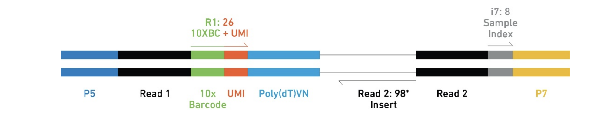

---
editor_options:
  chunk_output_type: console
---

# Download Data and Quantification

## What is single-cell RNA-seq?

Traditional RNA-seq (bulk) sequences RNA from millions of cells blended together - you get the average expression across all cells in your sample.

Single-cell RNA-seq (scRNA-seq) separates individual cells into droplets or wells, sequences each cell separately, then computationally figures out which reads came from which cell.

It seems intimidating the first time dealing with scRNAseq data. However, if you have worked on bulk RNA-seq data, the underlying data structure is the same: A Data Matrix!

My regret is not learning linear algebra well during college.

I barely passed the exam for it (and calculus, it was a nightmare :) ).

To be fair..

It was not taught well and it sounded too boring. I did not know what the application of matrix multiplication was, not until many years later, I started to learn bioinformatics. I find many data are just data matrices:

- an RNAseq expression matrix is a gene-by-sample matrix, with entries to be read counts for each gene
- a single-cell expression matrix is a gene-by-cell matrix, with entries to be read counts for each gene
- a ChIP-seq count matrix is a peak-by-sample matrix, with entries to be the number of reads in each peak
- a drug response matrix is a drug-by-sample matrix, with entries to be IC50 for example

and many more. In other words,

Matrix is EVERYWHERE for bioinformatics (and many other data science topics)!

Many of the bioinformatics problems can be rephrased as matrix manipulation.

The big picture transformation:

```
Tissue → Dissociated cells → Encapsulated in droplets/wells → Barcoded → Sequenced →
Demultiplexed → Count matrix (genes × cells)
```

Why do we care? Tissues are heterogeneous - different cell types, states, and responses. Bulk sequencing averages over all of that and you lose the information. scRNA-seq lets you see cell type composition, rare populations, cell state transitions, and cell-to-cell variability.

### But do you really need single-cell RNA-seq?

Before we go further, I want to be honest about something: scRNA-seq is not always the right choice. I see too many people reaching for single-cell because it's trendy, when bulk RNA-seq would answer their question better, faster, and cheaper.

Those colorful UMAP plots look great in papers. But ask yourself: does my biological question actually require single-cell resolution? If bulk RNA-seq can test your hypothesis, it's often the better option.

#### When bulk RNA-seq is sufficient (and better)

If you're working with cells sorted by flow cytometry (e.g., CD4+ T cells purified to >95% purity), bulk RNA-seq can answer your question perfectly well. You already know what cells you have -- no need to re-discover cell types computationally.

Same thing for homogeneous cell lines. If you're treating Jurkat cells with a drug and asking "what genes change?", bulk RNA-seq is simpler and gets you there. (That said, some cell lines are more heterogeneous than you think. If you suspect drug-resistant subclones, scRNA-seq could reveal that.)

Here's a budget trade-off that comes up a lot:

- Option A: 1 scRNA-seq sample per condition (4 conditions) = $4,000-8,000, no replicates
- Option B: 3 bulk RNA-seq replicates per condition (4 x 3 = 12 samples) = $3,000-5,000

Option B gives you statistical power, reproducibility, and more robust differential expression results.

The other thing to note is that, the input of RNA is in the range of 200ng-1ug.
Depending on what cell lines are you using, that's 2-5 millions of cells!

Most of the single-cell experiments capture ~10,000 cells. A million cells is a lot per sample.
It is very expensive if you want to sequence millions of cells.

The harsh truth: a single scRNA-seq sample without replicates has limited statistical validity for comparing conditions. You're trading cell-level resolution for sample-level inference.

> If comparing conditions (treatment vs control), aim for at least 2-3 biological replicates per condition - whether using bulk or single-cell.

#### When single-cell is worth it

Choose scRNA-seq when you need to discover unknown cell types, when heterogeneity IS your question ("do T cells exist on a continuum or discrete states?"), when you care about cell-type-specific responses ("which cell types respond to immunotherapy?"), when rare cells matter (cancer stem cells at <1% of tumor), or when you need trajectory analysis.

Don't choose it when your cells are already purified and homogeneous, when you just want average expression changes between conditions, when your budget doesn't allow proper replication, or -- let's be honest -- when it's just trendy but doesn't serve your hypothesis.

Bulk RNA-seq still has real advantages: simpler workflow, better per-gene coverage, easier replication, mature stats (DESeq2/edgeR are battle-tested), and you can run the analysis on a laptop. The downside is obvious: you lose all the heterogeneity information.

#### Cost comparison (2024 estimates)

| Method | Library Prep | Sequencing | Analysis Time | Skills Required |
|--------|-------------|------------|---------------|-----------------|
| **Bulk RNA-seq** | $100-200/sample | $300-500/sample | 1-2 weeks | Moderate R/Python |
| **scRNA-seq (10x)** | $800-1,500/sample | $1,000-2,000/sample | 1-3 months | Advanced bioinformatics |

For a 4-condition experiment with 3 replicates:

- Bulk: 12 samples x $500 = $6,000 + 2-3 weeks analysis
- Single-cell: 12 samples x $2,500 = $30,000 + 2-4 months analysis

Is the 5x cost and 4x time investment justified by your biological question? Sometimes yes, often no.

#### The replication problem

I see this mistake all the time:

> "I have 10,000 cells per sample - that's plenty of replication!"

No! Cells within a sample are pseudoreplicates. They're not independent. For testing condition effects (treatment vs control), you need independent biological samples (different animals/donors/cultures).

The correct design: 3 donors x 2 conditions = 6 samples for scRNA-seq. Aggregate to pseudo-bulk per donor per condition. Use DESeq2/edgeR with donor as replicate (N=3). We will talk about this more in Chapter 5.

One sample per condition? You can explore cell types and marker genes, but you cannot make strong statistical claims about treatment effects.

#### Quick decision guide

Ask yourself: what is my hypothesis? If it's about cell type composition or heterogeneity, go single-cell. If it's about average gene expression changes, bulk RNA-seq is fine. Can you afford replication with scRNA-seq? If not, bulk with good replication is the better investment.

Warning signs you're choosing scRNA-seq for the wrong reasons: "everyone in my field is doing it", "the UMAP plots look cool", "reviewers might be impressed." Those are not good reasons.

Good reasons: "I need to identify which cell types drive the disease phenotype", "we don't know the cellular composition of this tissue", "rare cells are biologically important."

The best experiment isn't the flashiest -- it's the one that answers your question reliably. This tutorial teaches you *how* to analyze scRNA-seq data, but knowing *when* to use it is equally important.

OK, let's get to it -- since you're here, you've presumably decided single-cell is the right tool for your question.

### The 10x Genomics Chromium platform

Our data is from 10x Genomics 3' chemistry -- the most widely used scRNA-seq platform. Here's how it works at a high level:

1. Cells and barcoded beads get mixed in oil droplets (Gel Bead-in-Emulsions, or GEMs)
2. Each bead has ~1M copies of oligos with a cell barcode (identifies which droplet), a UMI (tags individual mRNA molecules), and a poly(dT) primer (captures mRNA)
3. Reverse transcription happens inside the droplet, then you break the emulsion, amplify cDNA, and sequence

```{r echo=FALSE, fig.cap="10x Library Structure"}

```

### Why UMIs matter

Here's the problem: to get enough material for sequencing, we amplify cDNA with PCR. But PCR is exponential - one molecule becomes millions of copies. So if you see 1,000 reads for a gene, did they come from 1 molecule that got over-amplified, or from 1,000 original molecules?

UMIs (unique molecular identifiers) solve this. They're random barcodes added *before* amplification. If those 1,000 reads have 10 unique UMIs, we know there were ~10 original molecules. UMIs let us count molecules instead of reads. This is critical for accurate quantification.

### Cell barcodes

We sequence millions of cDNA fragments from thousands of cells mixed together. How do we know which cell each fragment came from? Each droplet gets a unique 16bp cell barcode. During sequencing:

- R1 contains the cell barcode (16bp) + UMI (10bp in v2, 12bp in v3). So R1 is 26bp in v2 and 28bp in v3.
- R2 contains the actual cDNA sequence (this is what maps to genes)

You group reads by cell barcode, count UMIs per gene per cell, and you get your count matrix.

### Sparse matrices

A typical scRNA-seq dataset might have 10,000 cells and 20,000 genes = 200 million possible gene-cell pairs. But most of them are zeros -- both for technical reasons (not all mRNA gets captured) and biological reasons (most genes are not expressed in any given cell). Typical sparsity is >90% zeros.

So we store only the non-zero entries in sparse matrix format (Matrix Market `.mtx` files). This can shrink memory usage from 100GB to 1GB. We'll see this format shortly when we look at the quantification output.

### From FASTQ to count matrix

The goal of this chapter is straightforward: transform raw sequencing reads (FASTQ files) into a count matrix (genes x cells).

```
FASTQ files (R1: barcodes+UMIs, R2: cDNA)
  ↓ [Extract cell barcodes and UMIs]
  ↓ [Map R2 reads to reference genome/transcriptome]
  ↓ [Count UMIs per gene per cell]
Count matrix (sparse)
```

This sounds simple, but there are practical challenges: millions of reads need fast alignment, reads can span splice junctions, and with 10,000 cells x 50,000 reads per cell, you're dealing with 500M reads.

### Why alevin-fry?

There are several tools for scRNA-seq quantification. Here's a quick comparison:

| Tool | Algorithm | Speed | Memory | Notes |
|------|-----------|-------|--------|-------|
| Cell Ranger | STAR (full alignment) | Slow | High (32GB+) | Official 10x pipeline |
| alevin-fry | Selective alignment | Fast | Low (16GB) | Lightweight, flexible |
| kallisto/bustools | Pseudoalignment | Very fast | Low | Mature, widely used |
| STARsolo | STAR + UMI counting | Medium | High | Multi-platform |

Lightweight mapping tools (alevin-fry, kallisto) are now recommended for standard workflows. The speed and memory savings are substantial, and the accuracy trade-off is minimal. See the "Quantification" chapter at sc-best-practices.org.

We use alevin-fry (via simpleaf) because it's fast (5-10x faster than full alignment), runs on laptops with 8-16GB RAM, works with any chemistry, and benchmarks show comparable accuracy to Cell Ranger.

When would you use Cell Ranger instead? If you need exact reproducibility with published 10x results, if you want Cell Ranger's QC web reports, or if your lab has an HPC cluster and everyone already uses it. The results are ~98% the same either way.

For learning and most research, alevin-fry is the pragmatic choice.

### The splici index

If you build a transcriptome-only index, reads from intronic regions (unspliced pre-mRNA) won't map and you'll undercount. In scRNA-seq, nuclear pre-mRNA is often captured, so this matters.

alevin-fry solves this with a "splici" index that contains both spliced transcripts (exon-exon junctions) and intronic sequences. To build it, we need:

- `genome.fa`: Reference genome sequence (FASTA format)
- `genes.gtf`: Gene annotations (GTF format - defines exons, genes, transcripts)

simpleaf builds the splici index from these files automatically.

---

## Description of the Data

The paper describing the dataset is at https://www.ncbi.nlm.nih.gov/pmc/articles/PMC6797728/

The GEO accession:
https://www.ncbi.nlm.nih.gov/geo/query/acc.cgi?acc=GSE126030

Experimental design:

>Single-cell RNA-sequencing of control and and anti-CD3/anti-CD28 stimulated T
cells from human lung, lymph node, bone marrow and blood.

For our purpose, we are going to download the raw data for 4 samples for
two conditions for blood: resting and CD3/CD28 activated

- SRX5329394 Donor A CD3/CD28 activated
- SRX5329395 Donor A resting
- SRX5329396 Donor B CD3/CD28 activated
- SRX5329397 Donor B resting

## Download the fastq files using fastq-dl

https://github.com/rpetit3/fastq-dl

Introduction of `conda`.

```{bash eval=FALSE}
conda create -n fastq_download -c conda-forge -c bioconda fastq-dl
conda activate fastq_download
```

**Tip**, `conda` is very slow. use `mamba` as a drop-in replacement for `conda`.

The relationship of Experiment to Run is a 1-to-many relationship, or there can be many Run accessions associated with a single Experiment Accession (e.g. re-sequencing the same sample). Although in most cases, it is a 1-to-1 relationship, you can use --group-by-experiment to merge multiple runs associated with an Experiment accession into a single FASTQ file.

This is is the case for our datasets: there are multiple SRR runs for the
same experiment

```{bash eval=FALSE}
FASTQ_DIR="$PWD/pbmc_RNAseq/data"

mkdir -p $FASTQ_DIR
cd $FASTQ_DIR

fastq-dl --accession SRX5329394  --group-by-experiment
fastq-dl --accession SRX5329395  --group-by-experiment
fastq-dl --accession SRX5329396  --group-by-experiment
fastq-dl --accession SRX5329397  --group-by-experiment
```

or write a for loop
```{bash eval=FALSE}
for i in SRX532939{4..7}
do
   fastq-dl --accession $i  --group-by-experiment
done
```

depending on your internet speed, it can take hours.
It took me:

```{bash eval=FALSE}
real    76m55.724s
user    3m53.484s
sys     6m15.335s
```

How big are the files?

```{bash eval=FALSE}

ls -shlt
total 97G
8.0K -rw-r--r-- 1 mtang mtang 6.8K Feb 24 22:13 fastq-run-info.tsv
4.0K -rw-r--r-- 1 mtang mtang  127 Feb 24 22:13 fastq-run-mergers.tsv
 19G -rw-r--r-- 1 mtang mtang  19G Feb 24 22:12 SRX5329397_R2.fastq.gz
5.2G -rw-r--r-- 1 mtang mtang 5.2G Feb 24 22:01 SRX5329397_R1.fastq.gz
 21G -rw-r--r-- 1 mtang mtang  21G Feb 24 21:57 SRX5329396_R2.fastq.gz
6.0G -rw-r--r-- 1 mtang mtang 6.0G Feb 24 21:44 SRX5329396_R1.fastq.gz
 18G -rw-r--r-- 1 mtang mtang  18G Feb 24 21:39 SRX5329395_R2.fastq.gz
5.2G -rw-r--r-- 1 mtang mtang 5.2G Feb 24 21:29 SRX5329395_R1.fastq.gz
 18G -rw-r--r-- 1 mtang mtang  18G Feb 24 21:10 SRX5329394_R2.fastq.gz
5.1G -rw-r--r-- 1 mtang mtang 5.1G Feb 24 20:59 SRX5329394_R1.fastq.gz
```

You will need at least 100G disk space for the raw fastq files.

### A note on the fastq files

This data is from 10x genomics 3' data.

From the 10x manual:

>The final Single Cell 3' Libraries contain the P5 and P7 primers used in Illumina bridge amplification PCR. The 10x Barcode and Read 1 (primer site for sequencing read 1) is added to the molecules during the GEMRT incubation. The P5 primer, Read 2 (primer site for sequencing read 2), Sample Index and P7 primer will be added during library construction

```{r echo=FALSE, out.width="100%", fig.align="center"}

```

>A Single Cell 3' Library comprises standard Illumina paired-end constructs which begin and end with P5 and P7. The Single Cell 3' **v2** 16 bp 10x Barcodes are encoded at the start of Read 1, while sample index sequences are incorporated as the i7 index read. Read 1 and Read 2 are standard Illumina sequencing primer sites used in paired-end sequencing. Read 1 is used to sequence the 16 bp 10x Barcode and 10 bp UMI, while Read 2 is used to sequence the cDNA fragment.

>Each sample index provided in the Chromium i7 Sample Index Kit combines 4 different sequences in order to balance across all 4 nucleotides.

After `cellranger mkfastq`, three `fastq.gz` files will be produced: `I1`, `R1` and `R2`. `I1` is the 8 bp sample barcode, `R1` is the 16bp `feature barcode` + 10 bp `UMI`, `R2` is the reads mapped to the transcriptome.

Feature barcode whitelist can be found at the cellranger installation path:  `cellranger-2.1.0/cellranger-cs/2.1.0/lib/python/cellranger/barcodes/737K-august-2016.txt`

compare v2 and v3 library https://teichlab.github.io/scg_lib_structs/methods_html/10xChromium3.html

> The V3 chemistry gave better sensitivity (detects more genes) comparing to the V2 chemistry. In addition, the oligo beads are modified to support feature barcoding. In terms of the 3' gene expression library preparation, there are only a few nucleotide differences for some oligos. **The final library structure is exactly the same, except that the UMI is 10-bp long in V2 but 12-bp in V3.** The cell barcodes whitelist for the V3 chemistry can be found here: 3M-february-2018.txt.gz. This file is copied from the Cell Ranger software (using Cell Ranger v3.1.0 as an example): cellranger-3.1.0/cellranger-cs/3.1.0/lib/python/cellranger/barcodes/3M-february-2018.txt.gz. Oligo sequences are provided for both V2 and V3 if they are different. Only V2 library preparation is drawn here.

So how do you know the library is 10x3' v2 or v3? The paper did not say anything on that. Let's find it out from the raw fastq files!

```{bash eval=FALSE}
zless -S SRX5329394_R1.fastq.gz | head -2 |tail -1
NTGCATACATGGGACATGCTAAGGAT
```

```{bash eval=FALSE}
zless -S SRX5329394_R1.fastq.gz | head -2 |tail -1 | wc -L
26
```

The cell barcode is 16bp. Total 26bp, so the UMI is 10bp. It is 10x3' v2!

How long are the R2 reads?

```{bash eval=FALSE}
zless -S SRX5329397_R2.fastq.gz | head -2 | tail -1

GGCACTCCTCCCCTCCTTCGCTTGCTCATCTTCTTTTGTTCATGTTTGTTAACGTTAATCTAATTTTTACTTCTGGATATCTTACTGTAGCCTCAGAT
```

```{bash eval=FALSE}
zless -S SRX5329397_R2.fastq.gz | head -2 | tail -1 | wc -L
98
```

### alignment and quantification using simpleaf

install `simpleaf`.

```{bash eval=FALSE}
conda create -n af -y -c bioconda -c conda-forge simpleaf
conda activate af
```

configuration

```{bash eval=FALSE}
# define env variable
export ALEVIN_FRY_HOME="$PWD/pbmc_RNAseq/af_home"

# simpleaf configuration
simpleaf set-paths
```
output:

```{bash eval=FALSE}
2024-02-25T04:07:52.567035Z  INFO simpleaf::simpleaf_commands::paths: The ALEVIN_FRY_HOME directory, /mnt/disks/tommy/pbmc_RNAseq/af_home, doesn't exist, creating...
2024-02-25T04:07:52.567985Z  INFO simpleaf::utils::prog_utils: could not find piscem executable, so salmon will be required.
found `salmon` in the PATH at /home/mtang/miniconda3/envs/af/bin/salmon
found `alevin-fry` in the PATH at /home/mtang/miniconda3/envs/af/bin/alevin-fry
```

To align the reads to the transcriptome, we need to build index first

```{bash eval=FALSE}
export AF_SAMPLE_DIR="$PWD/pbmc_RNAseq"

REF_DIR="$AF_SAMPLE_DIR/data/refdata-gex-GRCh38-2020-A"

mkdir -p $REF_DIR

IDX_DIR="$AF_SAMPLE_DIR/human-2020-A_splici"

# Download reference genome and gene annotations
wget -qO- https://cf.10xgenomics.com/supp/cell-exp/refdata-gex-GRCh38-2020-A.tar.gz | tar xzf - --strip-components=1 -C $REF_DIR
```

check the downloaded files

```{bash eval=FALSE}
ls refdata-gex-GRCh38-2020-A/*
refdata-gex-GRCh38-2020-A/reference.json

refdata-gex-GRCh38-2020-A/fasta:
genome.fa  genome.fa.fai

refdata-gex-GRCh38-2020-A/genes:
genes.gtf

refdata-gex-GRCh38-2020-A/pickle:
genes.pickle

refdata-gex-GRCh38-2020-A/star:
Genome   chrLength.txt      chrStart.txt      geneInfo.tab          sjdbList.fromGTF.out.tab
SA       chrName.txt        exonGeTrInfo.tab  genomeParameters.txt  sjdbList.out.tab
SAindex  chrNameLength.txt  exonInfo.tab      sjdbInfo.txt          transcriptInfo.tab
```

We only need the genome fasta file `genome.fa` and the gene annotation file
`genes.gtf`. Watch my youtube video xxx to understand those files and where
to get those files in addition to the place from 10x genomics.

Now, we are ready to build the index. Make sure the read length rlen is set correctly, I went to the fastq and `wc -L` the first read and it is 98 base pairs long.

```{bash eval=FALSE}
time simpleaf index \
--output $IDX_DIR \
--fasta $REF_DIR/fasta/genome.fa \
--gtf $REF_DIR/genes/genes.gtf \
--rlen 98 \
--threads 16


2024-02-25T04:24:44.426468Z  INFO simpleaf::simpleaf_commands::indexing: preparing to make reference with roers
2024-02-25T04:25:04.016066Z  INFO grangers::reader::gtf: Finished parsing the input file. Found 5 comments and 2765969 records.
2024-02-25T04:25:07.665010Z  INFO roers: Built the Grangers object for 2765969 records
2024-02-25T04:25:09.438211Z  INFO roers: Proceed 1305354 exon records from 199138 transcripts
2024-02-25T04:25:58.222209Z  INFO roers: Processing 1106216 intronic records
2024-02-25T04:27:52.481094Z  INFO roers: Done!
2024-02-25T04:27:52.797992Z  INFO simpleaf::simpleaf_commands::indexing: salmon index cmd : /home/mtang/miniconda3/envs/af/bin/salmon index -k 31 -i /mnt/disks/tommy/pbmc_RNAseq/human-2020-A_splici/index -t /mnt/disks/tommy/pbmc_RNAseq/human-2020-A_splici/ref/roers_ref.fa --threads 16
2024-02-25T04:44:32.659895Z  INFO simpleaf::utils::prog_utils: command returned successfully (exit status: 0)

real    19m48.292s
user    141m45.143s
sys     3m6.163s
```

### Quantification

Let's test the quantification for one sample

```{bash eval=FALSE}
# simpleaf quantification
simpleaf quant \
--reads1 $AF_SAMPLE_DIR/data/SRX5329394_R1.fastq.gz \
--reads2 $AF_SAMPLE_DIR/data/SRX5329394_R2.fastq.gz \
--threads 16 \
--index $IDX_DIR/index \
--chemistry 10xv2 --resolution cr-like \
--expected-ori fw --unfiltered-pl \
--t2g-map $IDX_DIR/index/t2g_3col.tsv \
--output $AF_SAMPLE_DIR/${sample}_quant
```

Note, for 3' chemistry, specify `--expected-ori fw`;
if it is 10x 5' chemistry, specify `--expected-ori rc`.
see https://github.com/COMBINE-lab/alevin-fry/issues/118

Now, let's loop over all the samples. We have two reads files per command
that are variable. Let's first create a txt file containing both reads
using some unix tricks.

```{bash eval=FALSE}
cd $FASTQ_DIR

# -1 print the files one file per line
ls -1 *gz
SRX5329394_R1.fastq.gz
SRX5329394_R2.fastq.gz
SRX5329395_R1.fastq.gz
SRX5329395_R2.fastq.gz
SRX5329396_R1.fastq.gz
SRX5329396_R2.fastq.gz
SRX5329397_R1.fastq.gz
SRX5329397_R2.fastq.gz

# save it to a file
ls -1 *gz > fastq.txt

cat fastq.txt
SRX5329394_R1.fastq.gz
SRX5329394_R2.fastq.gz
SRX5329395_R1.fastq.gz
SRX5329395_R2.fastq.gz
SRX5329396_R1.fastq.gz
SRX5329396_R2.fastq.gz
SRX5329397_R1.fastq.gz
SRX5329397_R2.fastq.gz

```

we then use the `tr` command to translate the `_` to a tab.
```{bash eval=FALSE}
cat fastq.txt | tr "_" "\t"
SRX5329394      R1.fastq.gz
SRX5329394      R2.fastq.gz
SRX5329395      R1.fastq.gz
SRX5329395      R2.fastq.gz
SRX5329396      R1.fastq.gz
SRX5329396      R2.fastq.gz
SRX5329397      R1.fastq.gz
SRX5329397      R2.fastq.gz
```

translate the `.` to tab and cut the only first two columns
```{bash eval=FALSE}
cat fastq.txt | tr "_" "\t" | tr "." "\t" | cut -f1,2
SRX5329394      R1
SRX5329394      R2
SRX5329395      R1
SRX5329395      R2
SRX5329396      R1
SRX5329396      R2
SRX5329397      R1
SRX5329397      R2

cat fastq.txt | tr "_" "\t" | tr "." "\t" | cut -f1,2 > files.txt

paste fastq.txt files.txt
SRX5329394_R1.fastq.gz  SRX5329394      R1
SRX5329394_R2.fastq.gz  SRX5329394      R2
SRX5329395_R1.fastq.gz  SRX5329395      R1
SRX5329395_R2.fastq.gz  SRX5329395      R2
SRX5329396_R1.fastq.gz  SRX5329396      R1
SRX5329396_R2.fastq.gz  SRX5329396      R2
SRX5329397_R1.fastq.gz  SRX5329397      R1
SRX5329397_R2.fastq.gz  SRX5329397      R2
```


see https://www.gnu.org/software/datamash/manual/html_node/Crosstab.html

We will use `datamash` to pivot this long table to a wide table.

```{bash eval=FALSE}
paste fastq.txt files.txt | datamash crosstab 2,3 unique 1
        R1      R2
SRX5329394      SRX5329394_R1.fastq.gz  SRX5329394_R2.fastq.gz
SRX5329395      SRX5329395_R1.fastq.gz  SRX5329395_R2.fastq.gz
SRX5329396      SRX5329396_R1.fastq.gz  SRX5329396_R2.fastq.gz
SRX5329397      SRX5329397_R1.fastq.gz  SRX5329397_R2.fastq.gz

# remove the first line
paste fastq.txt files.txt | datamash crosstab 2,3 unique 1 | sed '1d'
SRX5329394      SRX5329394_R1.fastq.gz  SRX5329394_R2.fastq.gz
SRX5329395      SRX5329395_R1.fastq.gz  SRX5329395_R2.fastq.gz
SRX5329396      SRX5329396_R1.fastq.gz  SRX5329396_R2.fastq.gz
SRX5329397      SRX5329397_R1.fastq.gz  SRX5329397_R2.fastq.gz

paste fastq.txt files.txt | datamash crosstab 2,3 unique 1 | sed '1d' > fq_path.txt

cat fq_path.txt
SRX5329394      SRX5329394_R1.fastq.gz  SRX5329394_R2.fastq.gz
SRX5329395      SRX5329395_R1.fastq.gz  SRX5329395_R2.fastq.gz
SRX5329396      SRX5329396_R1.fastq.gz  SRX5329396_R2.fastq.gz
SRX5329397      SRX5329397_R1.fastq.gz  SRX5329397_R2.fastq.gz
```

Now, we can read in this `fq_path.txt` file line by line.
read `-r sample R1 R2` will split the line into three fields and assign
to three shell variables: `sample`, `R1`, and `R2`.

```{bash eval=FALSE}
cat fq_path.txt | while read -r sample R1 R2
do
        echo $sample
        echo $R1
        echo $R2
done

SRX5329394
SRX5329394_R1.fastq.gz
SRX5329394_R2.fastq.gz
SRX5329395
SRX5329395_R1.fastq.gz
SRX5329395_R2.fastq.gz
SRX5329396
SRX5329396_R1.fastq.gz
SRX5329396_R2.fastq.gz
SRX5329397
SRX5329397_R1.fastq.gz
SRX5329397_R2.fastq.gz
```

We only have 4 samples, and you can just manually create the `fq_path.txt`.
When you have over a dozen of files and you want to be lazy, the unix command
tricks comes handy!

```{bash eval=FALSE}
cat fq_path.txt | while read -r sample R1 R2
do
   simpleaf quant \
        --reads1 $FASTQ_DIR/$R1 \
        --reads2 $FASTQ_DIR/$R2 \
        --threads 16 \
        --index $IDX_DIR/index \
        --chemistry 10xv2 --resolution cr-like \
        --expected-ori fw --unfiltered-pl \
        --t2g-map $IDX_DIR/index/t2g_3col.tsv \
        --output $AF_SAMPLE_DIR/${sample}_quant
done
```

Note on shell variable quoting and {}. see https://unix.stackexchange.com/questions/4899/var-vs-var-and-to-quote-or-not-to-quote

For 4 samples, the quantification takes

```{bash eval=FALSE}
real    66m20.682s
user    525m58.643s
sys     14m26.989s
```

That's very fast! The `cellranger` workflow may take several hours per sample.

### Check the output

```{bash eval=FALSE}
wc -l SRX5329394_quant/af_quant/alevin/quants_mat*
 15316171 SRX5329394_quant/af_quant/alevin/quants_mat.mtx
   109803 SRX5329394_quant/af_quant/alevin/quants_mat_cols.txt
   213855 SRX5329394_quant/af_quant/alevin/quants_mat_rows.txt
 15639829 total
```

`quants_mat_cols.txt` are the genes, and `quants_mat_rows.txt` are the unfiltered cells.

`quants_mat.mtx` is a sparse matrix. A sparse matrix is a way to represent
matrix with many 0s, it only record the non-zero entries to save space.
as you see, the full matrix is 213855 genes/rows by 109803 cells/columns.

Let's verify by checking the first 10 rows of the
files.

```{bash eval=FALSE}
head  SRX5329394_quant/af_quant/alevin/quants_mat*
==> SRX5329394_quant/af_quant/alevin/quants_mat.mtx <==
%%MatrixMarket matrix coordinate real general
% written by sprs
213855 109803 15316168
1 14 1
1 15 2
1 26 2
1 43 8
1 48 2
1 49 3
1 50 1

==> SRX5329394_quant/af_quant/alevin/quants_mat_cols.txt <==
ENSG00000243485
ENSG00000186092
ENSG00000241599
ENSG00000237491
ENSG00000228794
ENSG00000187634
ENSG00000223823
ENSG00000162571
ENSG00000162572
ENSG00000224870

==> SRX5329394_quant/af_quant/alevin/quants_mat_rows.txt <==
TCAGCTCGTATTACCG
GTACTTTAGTGTCTCA
CTGATAGTCATGCATG
TGAGAGGCATCACGAT
AACCATGCATGGTCAT
TGTGGTACATCATCCC
CGGAGTCTCCTACAGA
GCGACCAGTAGCGTAG
CGGTTAAAGAATCTCC
GACCTGGCAAGTAGTA
```

The first numeric row of the sparse `mtx` file is

213855 109803 15316168 which means 213855 rows and 109803 columns, and
15316168 non-zero entries.

1 14 1 means row 1, column 14 has an entry of 1.
1 15 2 means row 1, column 15 has an entry of 2.
etc etc.

If you want to learn more about working with sparse matrices in R, Kamil Slowikowski has an excellent tutorial: https://slowkow.com/notes/sparse-matrix/

Also check out the `sparseMatrixStats` Bioconductor package: https://bioconductor.org/packages/release/bioc/html/sparseMatrixStats.html

---

## Troubleshooting

Here are some common issues you might run into. I've seen all of these at one point or another.

**Index building fails or runs out of memory.** Index building needs ~16-32GB RAM. Try reducing thread count (`--threads 4` instead of 16) which uses less memory. If you don't have enough RAM, use pre-built indices or run on a cloud instance.

**Very few cells detected (<100 when expecting thousands).** This is almost always wrong chemistry specification. Check your R1 read length: 26bp means v2 (16bp barcode + 10bp UMI), 28bp means v3 (16bp barcode + 12bp UMI). Use `--chemistry 10xv2` or `--chemistry 10xv3` accordingly. We showed how to check this earlier with `wc -L`.

**Low mapping rate (<50%).** The most common causes: wrong organism reference (human data + mouse genome = disaster), wrong orientation (3' chemistry uses `--expected-ori fw`, 5' uses `rc`), or R1/R2 files swapped. Quick sanity check: R2 files should be ~3-4x larger than R1.

**"command not found: simpleaf".** Make sure your conda environment is activated (`conda activate af`). Check with `which simpleaf`.

**Out of disk space.** You need ~150GB total for this dataset (100GB FASTQ + 10GB index + output). Run `df -h` to check what you have.

**Permission denied.** Check write permissions with `ls -ld $PWD` and fix with `chmod u+w output_directory` if needed.

---

## Alternative quantification workflows

We use alevin-fry in this tutorial, but you should know about the alternatives. I briefly mention them here and in the Appendix below.

`kallisto/bustools` is very fast, widely used, and mature. `Cell Ranger` is the official 10x pipeline -- slower and more memory-hungry, but produces nice QC web reports and is widely accepted by reviewers. One gotcha with Cell Ranger: it requires specific FASTQ naming conventions (e.g., `SRX5329394_S1_L001_R1_001.fastq.gz`), so you'll need to rename files. See https://kb.10xgenomics.com/hc/en-us/articles/115003802691.

`STARsolo` is accurate and supports multiple platforms, but needs 32GB+ RAM.

---

## Summary

In this chapter, we went from raw FASTQ files to count matrices. We downloaded 4 samples (~97GB), built a splici index, and quantified everything in ~66 minutes with alevin-fry. The output is 213,855 genes x 109,803 barcodes (unfiltered) in sparse matrix format.

The key files you have now:

- `human-2020-A_splici/index/`: Reusable index for future samples
- `SRX532939{4-7}_quant/`: Quantification results (sparse matrices)

A few things to remember: always check your chemistry version (v2 vs v3) before running quantification. Use the `--unfiltered-pl` flag so you get ALL barcodes -- we'll need them for empty droplet removal in Chapter 2. And don't accidentally delete your FASTQ files before you're sure the quantification worked. Re-downloading 97GB is painful.

In the next chapter, we'll take these unfiltered matrices and do QC: generate reports with `alevinQC`, remove empty droplets with DropletUtils, and filter low-quality cells.

### Further reading

- simpleaf tutorial: https://github.com/COMBINE-lab/simpleaf
- alevin-fry documentation: https://alevin-fry.readthedocs.io/
- 10x Chemistry details: https://teichlab.github.io/scg_lib_structs/methods_html/10xChromium3.html
- sc-best-practices.org preprocessing chapter: https://www.sc-best-practices.org/preprocessing_visualization/preprocessing_quality_control.html
- OSCA book: https://bioconductor.org/books/release/OSCA.intro/
- He et al. (2022), "alevin-fry unlocks rapid, accurate and memory-frugal quantification of single-cell RNA-seq data"

## Session Information {-}

```{r}
sessionInfo()
```
